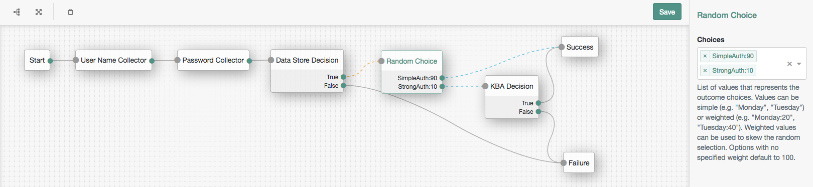

<!--
 * This code is to be used exclusively in connection with Ping Identity Corporation software or services. Ping Identity Corporation only offers such software or services to legal entities who have entered into a binding license agreement with Ping Identity Corporation.
 *
 * Copyright 2024 Ping Identity Corporation. All Rights Reserved
-->

# PingOne Verify

The PingOne Verify node utilizes the PingOne Verify service to enable four different types of secure
user verification. These verifications include:
* [Government ID](https://docs.pingidentity.com/r/en-us/pingone/pingone_pingoneverify_types_of_verification)
* [Facial Comparison Government ID](https://docs.pingidentity.com/r/en-us/pingone/pingone_pingoneverify_types_of_verification)
* [Facial Comparison Reference Selfie](https://docs.pingidentity.com/r/en-us/pingone/pingone_pingoneverify_types_of_verification)
* [Liveness](https://docs.pingidentity.com/r/en-us/pingone/pingone_pingoneverify_types_of_verification)

> At this time, no other PingOne Verification is supported by this node.

Identity Cloud provides the following artifacts to enable the PingOne Verify Node:

* [PingOne service](https://github.com/ForgeRock/tntp-ping-service/tree/cloudprep?tab=readme-ov-file#ping-one-service)
* [PingOne Verify node](https://github.com/ForgeRock/tntp-pingone-verify/blob/final-marcin-mods/README.md#pingone-verify-node)

You must set up the following before using the PingOne Verify node:

* [Create a verify policy](https://docs.pingidentity.com/r/en-us/pingone/pingone_creating_verify_policy)
* [Create a worker application](https://docs.pingidentity.com/r/en-us/pingone/p1_add_app_worker)
  * Requires [Identity Data Admin](https://apidocs.pingidentity.com/pingone/platform/v1/api/#roles) role
* [PingOne service](https://github.com/ForgeRock/tntp-ping-service/tree/cloudprep?tab=readme-ov-file#ping-one-service)

For more information on this node, refer to PingOne Verify node

## PingOne Verify setup
You must set up the following before using the PingOne Verify node:

* [Create a verify policy](https://docs.pingidentity.com/r/en-us/pingone/pingone_creating_verify_policy)
* [Create a worker application](https://docs.pingidentity.com/r/en-us/pingone/p1_add_app_worker)
  * Requires [Identity Data Admin](https://apidocs.pingidentity.com/pingone/platform/v1/api/#roles) role
* [PingOne service](https://github.com/ForgeRock/tntp-ping-service/tree/cloudprep?tab=readme-ov-file#ping-one-service)

## PingOne Verify node
The PingOne Verify node utilizes the PingOne Verify service to secure user verification.

### Compatibility
***

<table>
<colgroup>
<col>
<col>
</colgroup>
<thead>
<tr>
<th>Product</th>
<th>Compatible?</th>
</tr>
</thead>
<tbody>
<tr>
<td>
ForgeRock Identity Cloud
</td>
<td>
<i>✓</i>
</td>
</tr>
<tr>
<td>
ForgeRock Access Management (self-managed)
</td>
<td>
<i>✓</i>
</td>
</tr>
<tr>
<td>
ForgeRock Identity Platform (self-managed)
</td>
<td>
<i class="fa fa-check" title="yes">✓</i>
</td>
</tr>
</tbody>
</table>

### Inputs
***
Any data in the node state that needs to be sent to PingOne Verify for verification or authentication purposes.

### Dependencies
***
To use this node, you must configure the PingOne service.

### Configuration
***
The configurable properties for this node are:

<table><colgroup><col><col></colgroup><thead>
						<tr>
							<th class="entry colsep-1 rowsep-1" id="jzf1692634635960__table_y2d_vml_nyb__entry__1">Property</th>
							<th class="entry colsep-1 rowsep-1" id="jzf1692634635960__table_y2d_vml_nyb__entry__2">Usage</th>
						</tr>
					</thead><tbody class="tbody">
						<tr class="row">
							<td class="entry colsep-1 rowsep-1" headers="jzf1692634635960__table_y2d_vml_nyb__entry__1">
								
PingOne Service

							</td>
							<td class="entry colsep-1 rowsep-1" headers="jzf1692634635960__table_y2d_vml_nyb__entry__2">
                The PingOne Service used for this Verify Node</td>
						</tr>

<tr>
    <td>
        PingOne Verify UserID
    </td>
    <td>
        Name of the local attribute to store the PingOne UserID
    </td>
</tr>
<tr>
    <td>
        PingOne Verify Policy ID
    </td>
    <td>
        PingOne Verify Policy ID to be used in this flow
    </td>
</tr>

<tr>
    <td>
        Verify URL delivery mode
    </td>
<td>
Options are QR code, E-mail and SMS
</td>
</tr>

<tr>
<td>
Allow user to choose the verification url delivery method
</td>
<td>
If checked user will be prompted for delivery method
</td>
</tr>

<tr>
<td>
Flow Type
</td>

<td>
REGISTRATION (map verified document claims to objectProperties), VERIFICATION (match directory service attributes to verified document claims), AUTHENTICATION (a new live photo (selfie) compared with a reference photo provided)
</td>
</tr>

<tr>
<td>
Reference Photo
</td>

<td>
If using the AUTHENTICATION flow type above, this parameter refers to the name of the attribute that contains the reference photo used to send to PingOne Verify. The attribute must exist either in the nodestate or in the local datastore.
</td>
</tr>

<tr>
<td>
Age threshold
</td>

<td>
If specified (in years), node will extract DOB from the claims and validate if equal or greater than specified (0 or empty to disable age check)
</td>
</tr>

<tr>
<td>
Document Type Required for Registration
</td>
<td>
Options are DEFAULT, DRIVING_LICENSE, PASSPORT, or ID_CARD.  Used only for REGISTRATION flow type
</td>
</tr>

<tr>
<td>
Fail expired documents
</td>
<td>
For documents that contain expiration date, fail if out of date
</td>
</tr>

<tr>
<td>
Submission timeout
</td>
<td>
Verification submission timeout in seconds. Value must be under authentication session validity time.
</td>
</tr>

<tr>
<td>Save verified claims from PingOne Verify to sharedState</td>
<td>Saves verified claims from PingOne Verify API response to sharedState as a JSON object.  Name used - PingOneVerifyClaims</td>
</tr>

<tr>
<td>Save verification metadata from PingOne Verify to sharedState</td>
<td>Saves verification explanation data from PingOne Verify to sharedState as a JSON array. Name used - PingOneVerifyMetadata</td>
</tr>

<tr>
<td>Attribute Map</td>
<td>Map for picking which PingOne Verify Verified Claim(s) should correspond with the local datastore attribute(s). The KEY should be the PingOne Verify JSON key and the VALUE should be the corresponding local datastore attribute. This is used for the REGISTRATION and VERIFICATION scenarios (PingOne Verify to local datastore and local datastore to PingOne Verify)</td>
</tr>

<tr>
<td>Attributes to match</td>
<td>Specify the user attributes that have to match, following a successful verification by PingOne Verify (matching existing user attributes to verified claims)</td>
</tr>

<tr>
<td>Preserve matched attributes</td>
<td>If in a REGISTRATION flow type, tick this flag to preserve attributes that user provided prior to verification process. Otherwise the returned verified claims will be used.</td>
</tr>

<tr>
<td>Imprecise matching attribute confidence map</td>
<td>If selected, the user's attribute(s) are verified with imprecise matching in PingOne Verify (those attribute(s) must be present in the 'Attributes to match' configuration above). The value represents the minimum confidence level to mark a verification successful. Value options are LOW, MEDIUM, or HIGH.</td>
</tr>

<tr>
<td>Attribute lookup</td>
<td>If true, during a VERIFICATION flow type, the node will use the local datastore to lookup the 'Attributes to match' from the configuration above.  Otherwise, if false, objectAttributes in shared state are used.</td>
</tr>

<tr>
<td>Store access token in transientState</td>
<td>If checked, PingOne access token will be preserved in transientState.  Name used - p1AccessToken</td>
</tr>

<tr>
<td>Store PingOne Verify transaction id in transientState</td>
<td>If checked, PingOne Verify transaction id will be preserved in transientState.  Name used - p1VtxId</td>
</tr>

<tr>
<td>Demo mode</td>
<td>When checked, the node always returns SUCCESS outcome with example data</td>
</tr>

</tbody></table>

### Outputs
***
Depending on the configurations selected, the following may be the output for this node:
* Verified claims from PingOne Verify - PingOneVerifyClaims
* Verification metadata from PingOne Verify - PingOneVerifyMetadata
* Access Token used to communicate with the PingOne Verify APIs - p1AccessToken
* Transaction ID returned from PingOne Verify - p1VtxId

### Outcomes
***
`Success`

Successful attempt to get verified data

`Fail`

Failed to get verified data

`Error`

Reasons for Error could be that the session expired, UserID not defined, or value
missing in shared state

`No ID Match`

The PingOne pseudoanonymized userId provided (stored on the user or in SharedState), does not match any ID in PingOne

`Age Failed`

The age limit set, was not met
### Troubleshooting
***
If this node logs an error, review the log messages to find the reason for the error and address the issue appropriately.

### Examples
***
This example journey highlights the use of the PingOne Verify node for a Registration

